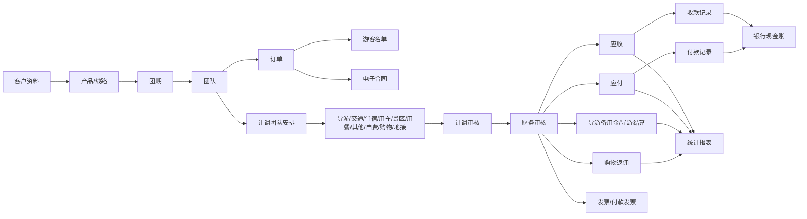

# MTravel 全系统调研总报告（只读）

调研日期：2026-05-09

系统地址：`http://www.mtravel.cn`

调研账号：`demo01`

账号角色：`老板账号`

公司主体：`测试地接社`

## 一、调研方法与边界

- 浏览方式：登录后只读访问页面、离线解析已保存的 HTML/截图、对代表性详情页做只读下钻。
- 明确未执行：新增、修改、删除、保存、提交、审核、收款、付款、销账、冲抵、导入、上传、授权、密码重置、状态变更。
- 覆盖范围：
  - 69 个菜单页
  - 22 个代表性详情页/操作页
  - 8 个一级模块
- 结果文件：
  - [MTravel旅行社接待管理系统总流程图](./MTravel旅行社接待管理系统总流程图.md)
  - [MTravel核心模块深度调研](./MTravel核心模块深度调研.md)
  - `/tmp/mtravel_survey/results.json`
  - `/tmp/mtravel_core_summaries.json`
  - `/tmp/mtravel_other_summaries.json`
  - `/tmp/mtravel_detail_survey/detail_results.json`

## 二、系统定位

从菜单结构、字段组织和跨模块流程看，`www.mtravel.cn` 是一套面向旅行社/地接社的综合经营系统，覆盖：

- 客户与合同
- 采购资源与供应商
- 产品、团期、团队、订单、游客
- 计调资源安排与审核
- 财务审核、应收应付、收付款、导游结算、返佣、发票
- 经营统计和报表
- 企业组织、员工、导游、费用项目、系统参数

它不是单点工具，而是把销售、计调、财务和管理层串成同一条业务链。

## 三、一级模块总览

| 一级模块 | 子模块数 | 角色定位 |
| --- | ---: | --- |
| 客户管理 | 3 | 客户主数据、客户分类、客户合同 |
| 采购管理 | 5 | 资源、供应商、采购关系、采购合同、车辆 |
| 销售管理 | 11 | 产品、团期、团队、订单、游客、电子合同 |
| 计调操作 | 6 | 履约安排、房态、接送、排班、审核 |
| 财务管理 | 17 | 团队财务审核、应收应付、收付款、发票、结算 |
| 数据统计 | 12 | 收客、利润、资源采购、账款、导游、报表中心 |
| 企业资料 | 9 | 部门、角色、员工、导游、银行账号、费用项目等 |
| 系统设置 | 6 | 参数、电子合同配置、日志、样式、快捷菜单等 |

## 四、端到端业务主流程

更完整流程图见：[MTravel旅行社接待管理系统总流程图](./MTravel旅行社接待管理系统总流程图.md)。

## 五、系统整体判断

### 1. 业务主线

系统主线非常清晰：

- 产品/线路
- 团期
- 团队
- 订单
- 游客/合同
- 计调安排
- 审核
- 收支结算
- 统计分析

### 2. 数据组织方式

系统不是用一个“大团队表单”处理所有履约数据，而是按资源类型拆成独立页：

- 导游
- 大交通
- 住宿
- 用车
- 景区
- 用餐
- 其他
- 自费
- 购物
- 地接

这说明其计调和成本核算模型是按资源成本中心设计的。

### 3. 审核链路

多个页面共享同一组流程状态：

- 团队安排完成/未完成
- 导游报账完成/未完成
- 计调审核完成/未完成
- 财务审核完成/未完成

这说明系统的履约闭环是统一状态机，而不是各模块各自为政。

### 4. 风险面

系统的大部分菜单都不是纯查询页，很多列表页本身就挂着写入按钮。高风险区域主要集中在：

- 团队和订单详情
- 各类资源安排页
- 计调审核、财务审核
- 收款、付款、导游结算、冲抵
- 银行现金账
- 员工、角色、系统参数

## 六、模块调研明细

## 1. 客户管理

客户管理是销售前端的主数据入口，向下连接团队、订单、应收和客户合同。

### 1.1 客户单位

- 入口：`/sale/BuyerManage.aspx`
- 用途：维护客户单位主档。
- 关键筛选：
  - 省/市/区县
  - 客户分类
  - 部门
  - 状态
  - 公司名/负责人
  - 员工姓名/用户名
  - 业务代码
- 关键字段：
  - 所在地、客户分类、部门、业务代码、操作计调、客户名称、负责人、员工、登记人、创建时间、合同有效期、状态
- 可见动作：
  - 状态修改
  - 添加
  - 导出报表
  - 应收账款
  - 产品授权
  - 合同管理
  - 员工
  - 修改
  - 删除
- 流程位置：
  - 上游是客户主数据维护
  - 下游进入订单、应收账款、客户合同、产品授权
- 风险判断：
  - `产品授权` 说明客户可被绑定可售产品
  - `应收账款` 说明客户和财务收款直接关联
  - `添加/修改/删除/状态修改` 均是写操作

### 1.2 客户分类

- 入口：`/sale/BuyerTypeManage.aspx`
- 用途：维护客户分类字典。
- 关键字段：
  - 分类名称、创建人、创建时间
- 可见动作：
  - 添加
  - 修改
  - 删除
- 流程位置：
  - 供客户单位、订单、统计等页面复用
- 风险判断：
  - 属于基础字典，改动会影响多处筛选和统计口径

### 1.3 客户合同管理

- 入口：`/company/ContractManage.aspx?ContractType=0`
- 用途：管理客户合同。
- 关键筛选：
  - 合同编号
  - 公司名称
- 关键字段：
  - 合同编号、公司名称、合同期限、结款方式、创建人、创建时间、有效期止、状态、打印、操作
- 可见动作：
  - 打印
  - 修改合同
  - 删除合同
  - 合同文件
- 流程位置：
  - 连接客户单位与收款结算条款
- 风险判断：
  - 该页虽然以合同台账形式展示，但本质是业务约束数据
  - `修改合同/删除合同` 为高风险

## 2. 采购管理

采购管理负责旅行资源、供应商、资源与供应商关系、采购合同和车辆等履约侧主数据。

### 2.1 资源总览

- 入口：`/purchase/ResourceList.aspx`
- 用途：查看和维护资源主档。
- 关键筛选：
  - 资源类型
  - 省/市/区县
  - 资源名称
- 关键字段：
  - 资源类型、城市、资源名称、电话、传真、已绑定、登记人、创建时间、操作
- 可见动作：
  - 添加
  - 导出报表
  - 绑定供应商
  - 资源图片
  - 修改
  - 删除
- 流程位置：
  - 上游是采购主数据
  - 下游进入团队安排和采购关系管理
- 风险判断：
  - `已绑定` 说明资源和供应商并非一对一
  - `绑定供应商` 会影响后续成本与采购路径

### 2.2 供应商管理

- 入口：`/purchase/SupplierManage.aspx`
- 用途：维护供应商档案。
- 关键筛选：
  - 资源类型
  - 省/市/区县
  - 公司名/负责人
- 关键字段：
  - 分类、所在地、客户名称、负责人、电话、登记人、创建时间、状态、操作
- 可见动作：
  - 添加
  - 导出报表
  - 应付账款
  - 合同管理
  - 员工
  - 图片
  - 修改
  - 删除
- 流程位置：
  - 下游进入应付账款、采购合同、资源安排
- 风险判断：
  - 从字段和入口看，供应商不只是一个公司名，还关联合同、联系人、应付

### 2.3 采购关系管理

- 入口：`/purchase/ResourceManage.aspx`
- 用途：管理资源和供应商之间的绑定关系。
- 关键筛选：
  - 资源类型
  - 省/市/区县
  - 资源名称
- 关键字段：
  - 所在地、资源名称、供应商、负责人、电话、创建人、创建时间、操作
- 可见动作：
  - 添加
  - 导出报表
  - 资源/供应商关系查看
- 流程位置：
  - 是采购资源模型的核心桥表页面
- 风险判断：
  - 它决定团队安排时可选的供应商来源

### 2.4 采购合同管理

- 入口：`/company/ContractManage.aspx?ContractType=1`
- 用途：管理采购侧合同。
- 关键筛选：
  - 合同编号
  - 公司名称
- 关键字段：
  - 合同编号、公司名称、合同期限、结款方式、创建人、创建时间、有效期止、状态、打印、操作
- 可见动作：
  - 打印
  - 修改合同
  - 删除合同
  - 合同文件
- 流程位置：
  - 约束供应商结算、票据和付款条件

### 2.5 车辆管理

- 入口：`/company/CarInfoManage.aspx`
- 用途：维护车辆台账。
- 关键筛选：
  - 车牌号/联系人/联系电话
  - 座位数
  - 备案状态
- 关键字段：
  - 车牌号、座位数、备案、上牌时间、保险时间、保养时间、年审时间、公里数、行驶证、联系人、联系电话、操作
- 可见动作：
  - 添加
  - 查看
  - 车辆图片
  - 修改
  - 删除
- 流程位置：
  - 供用车安排调用
- 风险判断：
  - 该页比一般“车辆列表”更像完整车辆档案系统

## 3. 销售管理

销售管理是系统的数据起点，覆盖产品、团期、团队、订单、费用变更、游客名单和电子合同。

更细字段与第二层详情页结论见：[MTravel核心模块深度调研](./MTravel核心模块深度调研.md)。

### 3.1 产品管理

- 入口：`/sale/LineManage.aspx`
- 用途：维护线路/产品模板。
- 关键字段：
  - 出发地、产品名称、标准、天数、创建人、创建时间
- 可见动作：
  - 附加费管理
  - 添加产品
  - 创建团队
  - 团期管理
  - 修改产品
  - 删除产品
  - 团队安排
  - 返点规则
  - 产品授权
- 关键判断：
  - 产品不是简单商品，而是可衍生成团期和团队的模板

### 3.2 团队管理

- 入口：`/sale/GroupManage.aspx`
- 用途：管理散拼、整团、散团、单项团队。
- 关键筛选：
  - 团号/团队名称/备注
  - 客户单位/业务员
  - 导游、操作计调、出发地、部门、业务类型
  - 订单状态
  - 出团日期
  - 天数
  - 团队状态
- 关键字段：
  - 类型、团号、客户、团队名称、天数、开始、结束、预控/实收、导游信息、资源进度、总进度
- 可见动作：
  - 团队详情
  - 导游/交通/住宿/用车/景区/用餐/其他/自费/购物/地接安排
- 关键判断：
  - 团队是销售、计调、财务的主汇聚对象

### 3.3 订单管理

- 入口：`/sale/OrderManage.aspx`
- 用途：管理订单明细和游客、价格、接送、酒店、文件。
- 关键筛选：
  - 团号、客户团号、预订单位/业务员
  - 出团日期、产品名称、航班号/接送备注
  - 订单金额、下单人、游客信息
  - 团队类型、订单状态、排序、标记状态、订单文件状态
- 关键字段：
  - 发团日期、订单信息、酒店信息、接送备注、客源地、客人、人数、价格详情、应收、已收、余额、费用说明、备注、状态
- 可见动作：
  - 导出名单
  - 导出报表
  - 拼团操作
  - 订单详情
  - 单项业务详情
  - 订单文件
- 关键判断：
  - 订单是系统最核心对象之一，承载价格、游客、酒店、接送、收款进度

### 3.4 散拼团队预订

- 入口：`/group/AgencyGroupArrangeConcise.aspx`
- 用途：按团队查看散拼团队预订与收客进度。
- 关键判断：
  - 这是销售和团队库存协同页，可能驱动订单新增或调整

### 3.5 拼团订单

- 入口：`/sale/PTOrderManage.aspx`
- 用途：管理拼团订单关系。
- 关键字段：
  - 拼团信息、人数、应收、已收、余额、变更、状态
- 风险判断：
  - `拼团操作` 会改变订单归属和团队关系

### 3.6 订单费用变更

- 入口：`/sale/incomeChangemanage.aspx`
- 用途：查询订单费用变更记录。
- 关键字段：
  - 类型、团号、客户名称、费用说明、金额、登记人、登记时间
- 关键判断：
  - 该页偏审计和查询，写入动作通常发生在订单详情内

### 3.7 电子合同

- 入口：`/EContract/EContractManage.aspx`
- 用途：管理电子合同。
- 关键字段：
  - 合同编号、团号、产品名称、合同人数、合同名单、创建人、合同状态
- 可见动作：
  - 查看合同
  - 修改合同
  - 删除合同
  - 订单详情
- 关键判断：
  - 合同服务依赖外部电子合同能力

### 3.8 历史团队

- 入口：`/sale/HistoryGroupSearching.aspx`
- 用途：查询历史团队和已删除团队。
- 关键字段：
  - 团队 ID、类型、团号、团队名称、天数、开始、结束、进度、状态
- 风险判断：
  - `恢复已删` 是写操作

### 3.9 团号日志

- 入口：`/sale/GroupNoLogSearching.aspx`
- 用途：追踪建团、建订单、团号变更等日志。
- 关键字段：
  - 团队 ID、团号、触发动作/方法、日志内容、出团日期、操作人、操作时间
- 关键判断：
  - 这是排查团号规则、异常变更和操作轨迹的重要审计页

### 3.10 名单查重

- 入口：`/sale/NameListChecking.aspx`
- 用途：按名单文本检查重复报名。
- 关键字段：
  - 客人姓名、证件号、性别、出生年月、客源地、客户类型、年龄、联系电话、团队
- 关键判断：
  - 该页处理敏感个人信息

### 3.11 客人信息

- 入口：`/TouristInfo/TouristManage.aspx`
- 用途：维护游客基础信息与报团历史。
- 关键筛选：
  - 省市区县、客人标签、姓名、英文名、身份证号、护照号、出生月日
- 关键字段：
  - 姓名、英文名、身份证号、护照号、性别、出生年月、年龄、联系电话、地区、标签、操作
- 可见动作：
  - 一键导入名单
  - 添加客人名单
  - 导入名单
  - 导出名单
  - 修改
  - 删除
  - 报团明细
- 风险判断：
  - 这是个人敏感信息集中页

## 4. 计调操作

计调操作把销售订单落到具体履约资源，是系统的执行中台。

### 4.1 团队安排

- 入口：`/Group/GroupArrangeConcise.aspx`
- 用途：按团队做资源安排。
- 关键筛选：
  - 团号/团队名称/备注、客户团号、客户单位/业务员
  - 导游、操作计调、出发地、部门、业务类型
  - 订单状态、出团日期、天数、下团日期
  - 供应商、资源名称、车牌号
  - 团队状态
  - 流程进度
- 关键字段：
  - 团号、客户、团队名称、天数、开始、接机、结束、送机、预控/实收、导游信息、资源进度、总进度
- 可见动作：
  - 团队总览
  - 各资源安排页
- 关键判断：
  - 这是履约调度总入口

### 4.2 团队审核

- 入口：`/Group/GroupMonitor.aspx`
- 用途：计调审核团队安排、导游报账、成本和收入。
- 关键字段：
  - 团队应收、预算成本、实际成本、自费加点、购物消费、进度、人次、消费额
- 关键判断：
  - 审核不是只看状态，而是直接对资源和成本做复核

### 4.3 导游排班汇总

- 入口：`/stat/GuideScheduling.aspx`
- 用途：横向查看导游在日期维度的排班占用。
- 关键字段：
  - 日期列、导游行
- 关键判断：
  - 偏日历式资源占用查看

### 4.4 接送信息

- 入口：`/sale/BusOrderManage.aspx`
- 用途：查看订单接送与用车安排。
- 关键字段：
  - 发团日期、订单信息、接站、送站、上下车地点、接送备注、客人、电话、人数、状态、安排
- 可见动作：
  - 导出报表
  - 订单详情
  - 订单文件
  - 用车安排

### 4.5 房态控制

- 入口：`/purchase/PurchaseDayPrice.aspx`
- 用途：按酒店/供应商/房型/日期查看余量。
- 关键字段：
  - 酒店、供应商、房型、日期余量
- 关键判断：
  - 更接近库存控制视图，而不是单纯酒店台账

### 4.6 应用中心

- 入口：`/application/index.aspx`
- 用途：应用扩展入口。
- 当前结论：
  - 在本次离线抽取中未看到明确表格和字段
  - 从菜单定位看，更像扩展服务入口而非主业务表

## 5. 财务管理

财务模块是系统最复杂的部分，既处理团队维度的财务审核，也处理单据级的应收应付、收付款、导游结算、发票和冲抵。

### 5.1 团队审核

- 入口：`/Finance/GroupList.aspx`
- 用途：财务审核团队账单和利润结果。
- 关键字段：
  - 团队应收、预算成本、实际成本、自费加点、购物消费、导服费、团队毛利、导游提成、公司利润
- 关键判断：
  - 团队账单是财务闭环中心页

### 5.2 团队预付款

- 入口：`/Finance/ImprestMoney.aspx`
- 用途：管理供应商/资源预付款。
- 关键筛选：
  - 资源类型、供应商、团号、责任计调、登记人、日期、已销
- 关键字段：
  - 付款单、类型、供应商、团号/订单号、费用说明、预算成本、预付、已付、余款、申领详情、操作
- 可见动作：
  - 合并付款单
  - 付款
  - 查看申领详情

### 5.3 银行现金账

- 入口：`/Finance/BankCashAccount.aspx`
- 用途：管理银行/现金流水。
- 关键筛选：
  - 账户、金额、客户单位、摘要/备注、经办人、登记人、日期、已销
- 关键字段：
  - 收支日期、银行、收付款单位、收入、支出、余额、摘要/备注、经办人、登记人、已销、可销、操作
- 可见动作：
  - 导入
  - 添加
  - 账户间转账
  - 企业码同步
  - 导出报表
  - 销账
  - 预付款销账
  - 修改
  - 打印
  - 删除
- 风险判断：
  - 这是全系统写入风险最高的财务页之一

### 5.4 应收帐款

- 入口：`/Finance/YingshouMoney.aspx`
- 用途：按客户单位汇总应收。
- 关键字段：
  - 客户单位、收客数、应收、已收、余款
- 可见动作：
  - 导出汇总报表
  - 导出明细报表

### 5.5 应收账款明细

- 入口：`/Finance/YingShouMoneyList.aspx`
- 用途：按订单/团队查看应收明细。
- 关键字段：
  - 团号/订单号、出团日期、产品名称、客户单位、收客数、应收、已收、余款、进度、审核、操作
- 可见动作：
  - 批量审核
  - 收款
  - 订单详情
  - 订单文件
  - 收款记录

### 5.6 应付帐款

- 入口：`/Finance/YingfuMoney.aspx`
- 用途：按供应商汇总应付。
- 关键字段：
  - 供应商名称、现付、现付已付、挂账、挂账已付、余款
- 可见动作：
  - 导出汇总报表
  - 导出明细报表

### 5.7 应付账款明细

- 入口：`/Finance/YingFuMoneyList.aspx`
- 用途：按供应商/费用项查看应付明细。
- 关键字段：
  - 付款单、类型、团号/订单号、团队名称、供应商、费用说明、现付、挂账、余款、导游、审核时间、操作
- 可见动作：
  - 付款
  - 团队账单

### 5.8 成本明细预览

- 入口：`/Finance/YingFuMoneyListPreview.aspx`
- 用途：预览团队成本明细。
- 关键字段：
  - 成本阶段、团队阶段、供应商、费用说明、现付、挂账、余款、导游、计调
- 可见动作：
  - 导出报表
  - 团队总览
  - 计调审核
  - 财务账单

### 5.9 导游备用金

- 入口：`/Finance/GuideImprest.aspx`
- 用途：管理导游备用金和企业码额度。
- 关键字段：
  - 团号、出发日期、团队名称、导游、计调、合计现付、备用金、企业码额度、应付、已付、余额
- 可见动作：
  - 导出报表
  - 付款
  - 查看申领详情
  - 授权
  - 团队总览
  - 订单文件

### 5.10 导游结算

- 入口：`/Finance/GuideSettlement.aspx`
- 用途：结算导游现付、收入、上交、奖罚、购物、自费等。
- 关键字段：
  - 导游、天数、备用金、导游现付、导游收入、导游上交、代收团款、财务费用、合计结算、已收/已付、余额
  - 成本拆分：交通、门票、房费、车费、餐费、其它、杂费、地接、导服、加点、购物、现结、奖罚、操作费
- 可见动作：
  - 导出报表
  - 收款
  - 付款
  - 团队账单

### 5.11 购物返佣

- 入口：`/Finance/ShopRebate.aspx`
- 用途：汇总购物返佣。
- 关键字段：
  - 购物店、进店人数、人头费、消费总额、佣金合计、应收合计、已收、余款
- 可见动作：
  - 导出报表
- 关键判断：
  - 该页是购物返佣汇总入口，明细需要额外参数下钻

### 5.12 收款记录

- 入口：`/Finance/IncomeRecord.aspx`
- 用途：维护收款记录。
- 关键字段：
  - 团号、方式、项目、收款日期、付款单位/付款账户、备注、收款金额、经办人、登记人、登记时间、操作
- 可见动作：
  - 导出报表
  - 修改
  - 删除

### 5.13 付款记录

- 入口：`/Finance/PaymentRecord.aspx`
- 用途：维护付款记录。
- 关键字段：
  - 团号、方式、项目、付款日期、收款单位/收款账户、备注、付款金额、经办人、登记人、登记时间、操作
- 可见动作：
  - 团队更正
  - 导出报表
  - 修改
  - 删除

### 5.14 发票记录

- 入口：`/Finance/InvoiceManage.aspx`
- 用途：维护开票记录。
- 关键字段：
  - 开票时间、团号、客户名称、发票抬头、开票方、订单已收、发票金额、发票号码、开票人、登记人、登记时间、操作
- 可见动作：
  - 添加
  - 导出报表
  - 修改
  - 删除
  - 订单详情

### 5.15 付款发票明细

- 入口：`/Finance/GetInvoiceManage.aspx`
- 用途：查看供应商付款发票/票据明细。
- 关键字段：
  - 类型、团号/订单号、发生日期、团队名称、供应商、费用说明、备注、计调、导游、付款金额、发票已收、票据
- 可见动作：
  - 导出报表

### 5.16 财务收支进度

- 入口：`/Finance/PaymentSchedule.aspx`
- 用途：按团队统一查看应收、应付、导游结算、购物返佣和总进度。
- 关键字段：
  - 团号、线路名称、团队人数、操作、导游、订单、供应商、导游结算、购物、收支进度、应收/已收/余额、应付/已付/余额、欠收、欠付
- 可见动作：
  - 导出报表
  - 团队账单
  - 应收明细
  - 应付明细
  - 导游结算
  - 购物返佣明细
- 关键判断：
  - 这是财务驾驶舱页面

### 5.17 应收应付冲抵

- 入口：`/Purchase/associatedmanage.aspx`
- 用途：维护供应商与采购商之间的账款关联并做冲抵。
- 关键字段：
  - 分类、所在地、供应商名称、采购商名称、操作
- 可见动作：
  - 冲抵销账
- 风险判断：
  - 这是非常高风险的财务动作页

## 6. 数据统计

统计模块把销售、计调、财务的结果沉淀成经营分析视图。

### 6.1 团队进度统计

- 入口：`/stat/receiving/GroupStatus.aspx`
- 用途：统计团队安排、导游报账、计调审核、财务审核完成情况。
- 关键字段：
  - 操作计调、总团数、团队安排、导游报账、计调审核、财务审核、占比
- 可见动作：
  - 导出报表
  - 统计
- 关键判断：
  - 它反映的是流程完成率，不是收入利润

### 6.2 收客统计

- 入口：`/stat/Receiving.aspx`
- 用途：做收客分析。
- 关键维度：
  - 开始日期、结束日期、部门、业务类型
- 可见统计口径：
  - 按业务员
  - 按产品统计
  - 按区域统计
  - 按客户统计
  - 按操作计调
  - 按收客计调
  - 按站点统计

### 6.3 利润统计

- 入口：`/stat/Profit.aspx`
- 用途：做利润分析。
- 关键维度：
  - 日期、部门、业务类型
- 可见统计口径：
  - 年度总览
  - 总览
  - 按业务员
  - 按产品
  - 按团队
  - 按客户
  - 按导游
  - 按操作计调
  - 按收客计调
  - 按订单
- 可见动作：
  - 刷新利润统计数据

### 6.4 资源采购统计-排团

- 入口：`/stat/Resource.aspx?CostType=1`
- 用途：按排团维度看资源采购。
- 可见分类：
  - 酒店、用车、用餐、景区、大交通、地接、附加、其他、杂费

### 6.5 资源采购统计-导游

- 入口：`/stat/Resource.aspx?CostType=2`
- 用途：按导游维度看资源采购。
- 可见分类：
  - 酒店、用车、用餐、景区、大交通、地接、购物、自费、其他

### 6.6 资源采购统计-计调

- 入口：`/stat/Resource.aspx?CostType=3`
- 用途：按计调维度看资源采购。
- 可见分类：
  - 酒店、用车、用餐、景区、大交通、地接、购物、自费、导游相关、其他

### 6.7 资源采购统计-财务

- 入口：`/stat/Resource.aspx?CostType=4`
- 用途：按财务维度看资源采购。
- 可见分类：
  - 酒店、用车、用餐、景区、大交通、地接、购物、自费、导游相关、财务费用、其他

### 6.8 账款统计

- 入口：`/stat/Account.aspx`
- 用途：按收付款和应收应付口径做账款统计。
- 可见口径：
  - 业务员应收账款
  - 收客计调应收账款
  - 应收账款
  - 应付账款
  - 收款统计
  - 付款统计

### 6.9 导游统计

- 入口：`/stat/Guide.aspx`
- 用途：按导游维度做带团和收入统计。
- 可见口径：
  - 总览
  - 带团统计
  - 购物统计
  - 自费统计
  - 杂费统计
- 可见动作：
  - 刷新统计人数

### 6.10 收款汇总统计

- 入口：`/Finance/IncomeStat.aspx`
- 用途：汇总收款流水。
- 关键筛选：
  - 项目、银行账户、收款单位、收款日期
- 关键字段：
  - 方式、项目、收款日期、收款单位、收款账户、收款金额、收款人、登记人、明细
- 可见动作：
  - 导出报表

### 6.11 付款汇总统计

- 入口：`/Finance/PaymentStat.aspx`
- 用途：汇总付款流水。
- 关键筛选：
  - 项目、银行账户、付款单位、付款日期
- 关键字段：
  - 方式、项目、付款日期、付款单位、付款账户、付款金额、付款人、登记人、明细
- 可见动作：
  - 导出报表

### 6.12 报表中心

- 入口：`/stat/ReportCenter.aspx`
- 用途：统一导出经营报表。
- 关键筛选：
  - 日期类型：按出团日期 / 按财务审核完成日期
  - 统计日期
  - 财务审核状态：全部 / 未审核 / 已审核
  - 团号
- 可见报表类型：
  - 客户订单明细
  - 团队费用成本明细
  - 团队挂账成本明细
- 关键判断：
  - 它是报表输出总入口，不是固定列表页

## 7. 企业资料

企业资料模块负责组织、人员、导游、银行账号、费用项目等内部主数据。

### 7.1 银行帐号

- 入口：`/company/BankAccountManage.aspx`
- 用途：维护银行账户和现金账入口。
- 关键字段：
  - 开户行、户名、帐号、打印、其它、创建人、创建时间、操作
- 可见动作：
  - 添加
  - 现金账
  - 修改
  - 删除
- 关键判断：
  - 该页是财务账户主数据，不是流水页

### 7.2 部门管理

- 入口：`/company/DepartmentManage.aspx`
- 用途：维护部门组织结构。
- 关键字段：
  - 部门名称、排序、状态、创建人、创建时间
- 可见动作：
  - 添加
  - 修改
  - 停用
  - 删除

### 7.3 角色管理

- 入口：`/company/RoleManage.aspx`
- 用途：维护角色。
- 关键字段：
  - 角色名称、创建人、创建时间
- 可见动作：
  - 添加
  - 修改
  - 删除
  - 权限管理
- 关键判断：
  - 从 `权限管理` 入口看，系统采用角色权限模型

### 7.4 员工管理

- 入口：`/company/EmployeeManage.aspx`
- 用途：维护员工和账号。
- 关键筛选：
  - 姓名/用户名/业务代码
  - 部门
- 关键字段：
  - 业务代码、员工名称、用户名、部门、角色、查看范围、性别、电话、手机、创建时间、状态、操作
- 可见动作：
  - 添加
  - 刷新订单提成比例
  - 修改
  - 停用
  - 删除
  - 重置密码
  - 员工名录
  - 员工账号
- 风险判断：
  - 这是组织权限和销售归属的核心页

### 7.5 导游管理

- 入口：`/company/GuideManage.aspx`
- 用途：维护导游档案。
- 关键筛选：
  - 姓名/用户名
  - 企业码状态
- 关键字段：
  - 导游名称、用户名、性别、证件号、电话、手机、账号、创建时间、状态、企业码状态、操作
- 可见动作：
  - 添加
  - 导出报表
  - 修改
  - 停用
  - 删除
  - 导游信息
- 关键判断：
  - 导游侧和企业码/签约能力已经打通

### 7.6 费用项目

- 入口：`/company/ResourceProjectManage.aspx`
- 用途：维护费用项目字典。
- 关键筛选：
  - 项目名称
- 关键字段：
  - 资源类型、项目名称、统计、排序、创建人、创建时间、操作
- 可见动作：
  - 添加
  - 修改
  - 删除
- 关键判断：
  - 费用项目会进入采购、计调、财务统计口径

### 7.7 接送站管理

- 入口：`/Company/StationManage.aspx`
- 用途：维护接送站点。
- 关键字段：
  - 所在城市、接送站名称、创建人、创建时间、操作
- 可见动作：
  - 添加
  - 修改
  - 删除

### 7.8 公众号管理

- 入口：`/company/WeChatManage.aspx`
- 用途：维护公众号信息。
- 关键字段：
  - 二维码、公众号名称、帐号、创建人、创建时间、操作
- 当前判断：
  - 从字段看，这是微信公众账号配置台账

### 7.9 合同模板管理

- 入口：`/company/ContractTemplateManage.aspx`
- 用途：管理合同模板文件。
- 关键字段：
  - 类型、合同模板、操作
- 可见动作：
  - 上传模板
  - 下载模板
- 关键判断：
  - 合同输出依赖模板文件管理

## 8. 系统设置

系统设置不是“皮肤配置”那么简单，其中的参数页直接控制登录规则、审核链、利润统计口径和财务后锁定逻辑。

### 8.1 页眉页脚印章

- 入口：`/company/UploadWordHeader.aspx`
- 用途：上传/管理页眉、页脚、印章。
- 关键字段：
  - 类型、效果预览、操作
- 可见动作：
  - 上传印章
  - 上传页眉
  - 上传页脚
  - 删除印章
  - 删除页眉
  - 删除页脚
- 关键判断：
  - 它服务于合同、单据、打印件输出

### 8.2 系统风格设置

- 入口：`/company/StyleManage.aspx`
- 用途：选择系统风格。
- 可见动作：
  - 已选择
  - 选择
- 当前判断：
  - 偏展示样式配置，对业务流影响较弱

### 8.3 快捷菜单设置

- 入口：`/user/ShortMenuManage.aspx`
- 用途：配置个人快捷菜单，最多 8 个子菜单。
- 当前观察：
  - 可选择的快捷项覆盖产品管理、供应商管理、利润统计、发票记录、付款记录等多个模块
- 关键判断：
  - 它是效率功能，不改变业务数据

### 8.4 系统参数配置

- 入口：`/company/SysConfig.aspx`
- 用途：配置系统级流程规则。
- 可见关键参数：
  - 同一用户只能同时登录一台电脑
  - 选择地接资源时只显示本公司添加的数据
  - 关闭计调界面的导游报账功能
  - 搜索操作计调默认显示自己
  - 登录时必须修改初始密码
  - 关闭计调审核功能
  - 财务费用不计入利润统计
  - 房、车审核后计调审核才能完成
  - 导游报账时限和计调审核提醒
  - 启用酒店延住
  - 财务审核完成后限制修改数据
  - 设置导游报账不可见团队时间
  - 订车单样式
  - 隐藏导游报账单的当团/隔月结算
  - 财务审核完成后是否仍允许费用变更
  - 导游报账单不显示附加费用
  - 订单管理显示字段开关：接送备注/费用说明/订单备注
  - 只能通过现金账功能进行销账
  - 默认锁定团号
  - 业务代码唯一
  - 展示“散拼团队预订”菜单
  - 预控人数校验
  - 导游提成方式
- 关键判断：
  - 这页决定系统核心行为，不是普通参数页

### 8.5 电子合同配置

- 入口：`/EContract/EContractconfig.aspx`
- 用途：配置电子合同服务。
- 关键字段：
  - 项目、详细信息、状态
- 可见动作：
  - 修改
  - 关闭服务
  - 查看
- 关键判断：
  - 电子合同能力是可启停的服务项

### 8.6 系统操作日志

- 入口：`/system/Log.aspx`
- 用途：查看系统访问日志。
- 关键筛选：
  - 姓名/用户名
  - 页面名称
  - 参数
  - 请求方法
  - 记录时间
- 关键字段：
  - 记录编号、页面名称、参数内容、IP/记录时间、用户姓名、请求方法
- 关键判断：
  - 日志能记录访问路径、参数、IP、时间和请求方法
  - 在 2026-05-09 的只读调研中，普通页面浏览均被记录为 `GET`

## 七、第二层详情页结论

本次只读下钻了 22 个详情页/操作页，得出的核心结论如下。

### 1. 产品详情页不是轻量商品卡

`/sale/LineAdd.aspx` 中可见：

- 基本信息
- 行程内容
- 产品说明
- 团队安排
- 业务类型管理
- 团期管理

说明产品本质上是线路模板。

### 2. 产品与团队之间存在“团期”层

`/sale/LineGroupList.aspx` 中可见：

- 团号
- 发团日期
- 操作计调
- 状态
- 总位/余位
- 单房差价格
- 客户类型价格

说明产品不是直接生成一个团队，而是先进入团期。

### 3. 团队详情页是业务总入口

`/sale/TeamOperation.aspx` 同时展示：

- 团队阶段：收客、排团、发团、结算、完成
- 团队主信息
- 团内订单列表
- 打印、订单文件、导出名单、结算单等工具

这页连接销售、计调、财务三个域。

### 4. 订单详情对象非常重

`/sale/BookingAgent.aspx` 和 `/sale/SingleBusinessAdd.aspx` 展示：

- 订单信息
- 行程说明
- 导游相关
- 客户信息
- 价格信息
- 酒店信息
- 附加说明
- 费用变更记录
- 游客名单

说明订单不是单纯收客记录，而是完整业务单据。

### 5. 订单文件是独立附件模块

`/sale/OrderFileManage.aspx` 页面结构较轻，以文件列表和上传控件为主，说明附件与订单主表单解耦。

### 6. 资源安排采用“多页分资源类型”模型

下列页面共享团队概况、成本汇总、打印工具和标签体系：

- `GuidePlan.aspx`
- `TrafficPlan.aspx`
- `HotelPlan.aspx`
- `BusPlan.aspx`
- `TicketPlan.aspx`
- `MealPlan.aspx`
- `OtherPlan.aspx`
- `ZifeiPlan.aspx`
- `ShopPlan.aspx`
- `TravelPlan.aspx`

它们并非零散页面，而是一个统一的履约成本模型。

### 7. 计调审核和财务审核都站在团队账单视角

- `GroupAuditing.aspx` 更偏计调复核
- `Finance/GroupBills.aspx` 更偏财务审核和结算

二者都汇总交通、住宿、用车、景区、用餐、其他、地接、自费、购物、导游等成本与收入。

### 8. 财务页面支持团队级 drill-down

以下页面支持直接按 `GroupId` 下钻：

- 应收明细
- 应付明细
- 导游结算

说明财务总览上的金额都能追到具体业务单据。

### 9. 购物返佣详情需要额外参数

直接只带 `GroupId` 打开：

- `ShopRebateDetail.aspx?GroupId=261556`

页面弹出 `缺少必要参数!`，未进入有效内容。

结论：

- 购物返佣详情页除了 `GroupId`，大概率还需要购物店或返佣记录参数。

## 八、关键控制点

### 1. 团队类型贯穿全系统

统一可见的团队类型包括：

- 散拼
- 整团
- 散团
- 单项

### 2. 订单状态贯穿销售到财务

常见状态包括：

- 未处理
- 已确认
- 已取消
- 无订单

### 3. 资源安排状态是履约完成度核心

统一资源进度列包括：

- 导
- 交
- 住
- 车
- 景
- 餐
- 其
- 自
- 购
- 地

### 4. 财务审核后可被系统参数锁定

系统参数明确存在：

- 财务审核完成后限制修改数据
- 是否仍允许费用变更

这说明财务审核不是单纯统计动作，而是流程锁定点。

### 5. 订单展示字段可被系统参数控制

订单页可按参数决定是否显示：

- 接送备注
- 费用说明
- 订单备注

说明系统有一定的界面可裁剪能力。

### 6. 销账路径被强约束

参数页可见：

- 只能通过现金账功能进行销账操作

这意味着销账被收束在 `银行现金账` 模块，不分散在多个财务页。

## 九、最重要的系统认知

### 1. 这套系统的核心对象不是客户，也不是订单，而是“团队”

从销售、计调、财务、统计四端看，团队都是中心对象：

- 团队聚合订单
- 团队承接资源安排
- 团队做计调审核和财务审核
- 团队做应收应付汇总
- 团队做收支进度和利润统计

### 2. 自费和购物不是附属字段，而是独立收益模块

自费和购物在资源安排、财务审核、导游结算、返佣统计里都被单独拆开，说明这两类收入在业务模型中地位很高。

### 3. 导游是独立结算主体

系统不只是记录导游姓名，而是围绕导游建立了：

- 导游管理
- 导游排班
- 导游备用金
- 导游结算
- 导游统计
- 企业码状态

### 4. 财务并不是事后记账，而是强流程参与者

财务参与：

- 团队审核
- 应收应付
- 收付款
- 银行现金账
- 发票
- 导游结算
- 返佣
- 冲抵
- 收支进度

### 5. 这套系统具备较强的内部审计痕迹

可见审计能力包括：

- 团号日志
- 系统操作日志
- 历史团队/已删团队查询
- 订单费用变更记录
- 多阶段审核状态

## 十、结论

截至 2026-05-09，本次只读调研已经覆盖该系统的主要结构、主业务链、全部一级模块和全部已见子模块。

最终判断如下：

- 这是一套完整的旅行社/地接社经营系统，不是单纯 CRM 或财务软件。
- 其业务主轴是：`产品 -> 团期 -> 团队 -> 订单 -> 计调安排 -> 审核 -> 财务收支 -> 统计报表`。
- 其最关键的业务中心是 `团队` 和 `团队账单`。
- 其最关键的控制面是 `系统参数配置`、`角色/员工管理`、`银行现金账`、`团队审核`、`财务审核`。
- 其最关键的高风险页面是所有带有 `保存/审核/收款/付款/销账/冲抵/导入/上传/删除` 的入口。

如果后续要继续做更深层的系统分析，最值得下钻的是：

- 角色的权限矩阵
- 团队账单页的审核通过条件
- 购物返佣详情参数模型
- 电子合同服务的外部接口关系
- 报表中心各报表的输出字段定义
