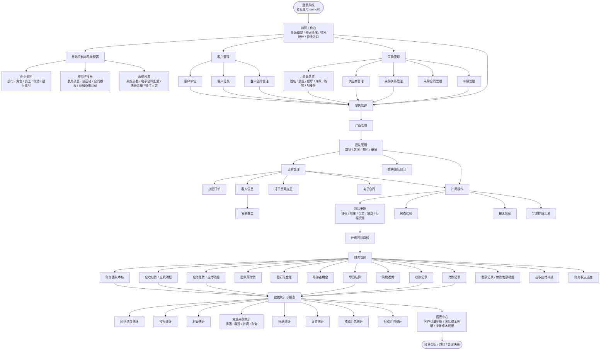
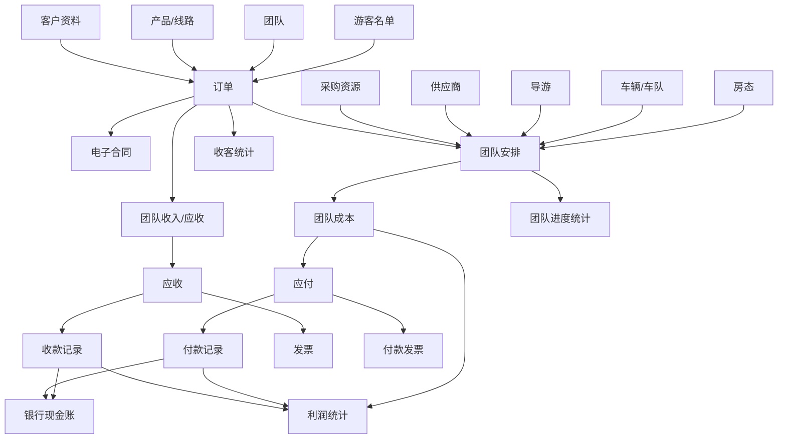
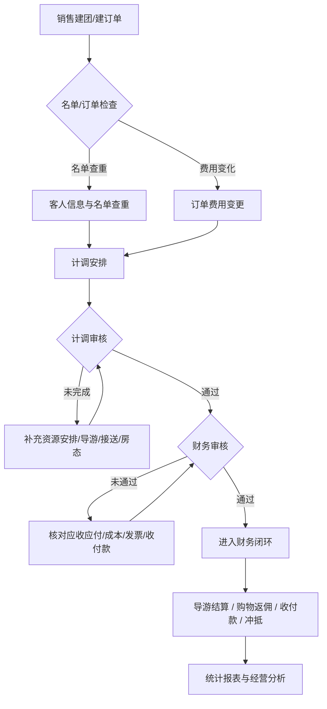

# MTravel 旅行社接待管理系统总流程图

> 基于 `demo01` 账号只读浏览到的菜单与页面结构整理。未执行新增、修改、删除、保存、审核、收付款等写入动作。

## 1. 系统端到端业务主流程

```mermaid
flowchart TB
    Start([登录系统<br/>老板账号 demo01]) --> Home[首页工作台<br/>资源概览 / 合同提醒 / 收客统计 / 快捷入口]

    Home --> Base[基础资料与系统配置]
    Home --> Customer[客户管理]
    Home --> Purchase[采购管理]
    Home --> Sales[销售管理]

    Base --> Org[企业资料<br/>部门 / 角色 / 员工 / 导游 / 银行账号]
    Base --> Cost[费用与模板<br/>费用项目 / 接送站 / 合同模板 / 页眉页脚印章]
    Base --> Config[系统设置<br/>系统参数 / 电子合同配置 / 快捷菜单 / 操作日志]

    Customer --> Buyer[客户单位]
    Customer --> BuyerType[客户分类]
    Customer --> BuyerContract[客户合同管理]

    Purchase --> Resource[资源总览<br/>酒店 / 景区 / 餐厅 / 车队 / 购物 / 地接等]
    Purchase --> Supplier[供应商管理]
    Purchase --> Relation[采购关系管理]
    Purchase --> PurchaseContract[采购合同管理]
    Purchase --> Vehicle[车辆管理]

    Buyer --> Sales
    BuyerType --> Sales
    BuyerContract --> Sales
    Resource --> Sales
    Supplier --> Sales
    Relation --> Sales
    Vehicle --> Sales

    Sales --> Product[产品管理]
    Product --> Team[团队管理<br/>散拼 / 散团 / 整团 / 单项]
    Team --> Order[订单管理]
    Team --> GroupBooking[散拼团队预订]
    Order --> PTOrder[拼团订单]
    Order --> Tourist[客人信息]
    Tourist --> Duplicate[名单查重]
    Order --> ExpenseChange[订单费用变更]
    Order --> EContract[电子合同]

    Team --> Dispatch[计调操作]
    Order --> Dispatch

    Dispatch --> Arrange[团队安排<br/>住宿 / 用车 / 导游 / 接送 / 行程资源]
    Dispatch --> RoomStatus[房态控制]
    Dispatch --> Bus[接送信息]
    Dispatch --> GuideSchedule[导游排班汇总]
    Arrange --> OpAudit[计调团队审核]

    OpAudit --> Finance[财务管理]
    Finance --> FinanceAudit[财务团队审核]
    Finance --> AR[应收账款 / 应收明细]
    Finance --> AP[应付账款 / 应付明细]
    Finance --> Prepay[团队预付款]
    Finance --> BankCash[银行现金账]
    Finance --> GuideAdvance[导游备用金]
    Finance --> GuideSettle[导游结算]
    Finance --> ShopRebate[购物返佣]
    Finance --> Income[收款记录]
    Finance --> Payment[付款记录]
    Finance --> Invoice[发票记录 / 付款发票明细]
    Finance --> Offset[应收应付冲抵]
    Finance --> Progress[财务收支进度]

    FinanceAudit --> Stats[数据统计与报表]
    AR --> Stats
    AP --> Stats
    Income --> Stats
    Payment --> Stats
    GuideSettle --> Stats

    Stats --> GroupStatus[团队进度统计]
    Stats --> Receiving[收客统计]
    Stats --> Profit[利润统计]
    Stats --> ResourceStat[资源采购统计<br/>排团 / 导游 / 计调 / 财务]
    Stats --> AccountStat[账款统计]
    Stats --> GuideStat[导游统计]
    Stats --> IncomeStat[收款汇总统计]
    Stats --> PaymentStat[付款汇总统计]
    Stats --> ReportCenter[报表中心<br/>客户订单明细 / 团队成本明细 / 挂账成本明细]

    ReportCenter --> End([经营分析 / 对账 / 管理决策])
```

## 2. 按角色/部门看的协作流程

```mermaid
flowchart LR
    subgraph Admin[老板 / 管理员]
        A1[系统参数配置]
        A2[部门角色员工权限]
        A3[合同模板与电子合同配置]
        A4[操作日志查看]
    end

    subgraph Master[基础资料维护]
        M1[客户单位与分类]
        M2[供应商与采购资源]
        M3[导游 / 车辆 / 银行账号]
        M4[费用项目 / 接送站]
    end

    subgraph SalesDept[销售]
        S1[产品管理]
        S2[团队管理]
        S3[订单管理]
        S4[游客名单 / 名单查重]
        S5[费用变更]
        S6[电子合同]
    end

    subgraph OpsDept[计调]
        O1[团队安排]
        O2[住宿 / 用车 / 导游 / 接送]
        O3[房态控制]
        O4[导游排班]
        O5[计调审核]
    end

    subgraph FinanceDept[财务]
        F1[团队财务审核]
        F2[应收 / 收款]
        F3[应付 / 付款]
        F4[导游备用金 / 导游结算]
        F5[购物返佣]
        F6[发票 / 银行现金账 / 冲抵]
    end

    subgraph Boss[管理层]
        B1[团队进度]
        B2[收客与利润]
        B3[资源采购]
        B4[账款与导游统计]
        B5[报表中心]
    end

    Admin --> Master
    Master --> SalesDept
    SalesDept --> OpsDept
    OpsDept --> FinanceDept
    FinanceDept --> Boss
    Boss --> Admin
```

## 3. 核心数据流

```mermaid
flowchart TB
    C[客户资料] --> O[订单]
    P[产品/线路] --> O
    T[团队] --> O
    G[游客名单] --> O
    O --> EC[电子合同]
    O --> TA[团队安排]

    R[采购资源] --> TA
    SUP[供应商] --> TA
    GD[导游] --> TA
    CAR[车辆/车队] --> TA
    ROOM[房态] --> TA

    TA --> COST[团队成本]
    O --> INC[团队收入/应收]
    COST --> AP[应付]
    INC --> AR[应收]

    AR --> INCOME[收款记录]
    AP --> PAYMENT[付款记录]
    PAYMENT --> BANK[银行现金账]
    INCOME --> BANK
    AR --> INVOICE[发票]
    AP --> PINVOICE[付款发票]

    INCOME --> PROFIT[利润统计]
    PAYMENT --> PROFIT
    COST --> PROFIT
    TA --> PROGRESS[团队进度统计]
    O --> RECEIVING[收客统计]
```

## 4. 关键控制点

```mermaid
flowchart TB
    Create[销售建团/建订单] --> Check1{名单/订单检查}
    Check1 -->|名单查重| TouristCheck[客人信息与名单查重]
    Check1 -->|费用变化| Change[订单费用变更]
    TouristCheck --> Dispatch[计调安排]
    Change --> Dispatch

    Dispatch --> Check2{计调审核}
    Check2 -->|未完成| FixOps[补充资源安排/导游/接送/房态]
    FixOps --> Check2
    Check2 -->|通过| FinanceCheck{财务审核}

    FinanceCheck -->|未通过| FixFinance[核对应收应付/成本/发票/收付款]
    FixFinance --> FinanceCheck
    FinanceCheck -->|通过| Locked[进入财务闭环]

    Locked --> Settlement[导游结算 / 购物返佣 / 收付款 / 冲抵]
    Settlement --> Report[统计报表与经营分析]
```

