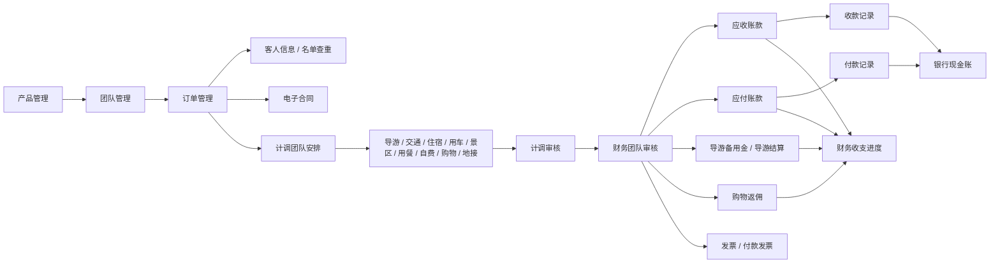

# MTravel 核心模块深调研

调研范围：销售管理、计调操作、财务管理，共 34 个子模块。

调研方式：使用 `demo01` 账号登录后，只读访问页面并离线解析已保存的 HTML/截图。未执行新增、编辑、删除、保存、提交、审核、收款、付款、导入、上传、冲抵、结算等写入动作。

辅助材料：

- 总流程图：[MTravel旅行社接待管理系统总流程图](./MTravel旅行社接待管理系统总流程图.md)
- 页面 HTML/截图：`/tmp/mtravel_survey`
- 结构化抽取结果：`/tmp/mtravel_core_summaries.json`

## 一、核心业务闭环

## 二、销售管理

销售管理承担产品、团队、订单、游客名单、费用变更和电子合同的前端业务入口，是整个系统的数据起点。

### 1. 产品管理

入口：`/sale/LineManage.aspx`

用途：维护线路/产品，并由产品生成团期或团队。

筛选条件：

- 产品名称

列表字段：

- 序号、出发地、产品名称、标准、天数、创建人、创建时间、操作

页面按钮：

- 附加费管理：进入 `/purchase/FuJiaFeiProductDayPrice.aspx`
- 添加产品：进入 `LineAdd.aspx?menu=A1&LineType=1`

行内操作：

- 创建团队
- 团期管理
- 修改产品
- 删除产品
- 团队安排
- 返点规则
- 产品授权

风险判断：

- “添加产品、创建团队、修改产品、删除产品、返点规则、产品授权”均可能改变业务数据。
- “团队安排”进入后可能触发计调资源安排。

上下游关系：

- 上游依赖采购资源、供应商、费用项目等基础资料。
- 下游生成团队、团期、订单和计调安排。

### 2. 团队管理

入口：`/sale/GroupManage.aspx`

用途：管理团队主档，覆盖散拼、整团、散团、单项等团队类型，并展示资源安排进度。

筛选条件：

- 团号/团队名称/备注
- 客户单位/业务员
- 导游
- 操作计调
- 出发地
- 部门
- 业务类型：疗休养、定制团、红色培训、门票冲量、花千骨、特惠游、漂流、落地散、地接团等
- 订单状态：未处理、已确认、已取消、无订单
- 出团日期始/止
- 添加日期
- 天数
- 团队状态：全部团队、未发团、已发团、已停售、已取消

列表字段：

- 类型、团号、客户、团队名称、天数、开始、结束、出发地、预控/实收、导游信息
- 资源进度列：导、交、住、车、景、餐、其、自、购、地
- 总进度

页面按钮：

- 散拼
- 整团
- 散团
- 单项

行内入口：

- 团队详情：`TeamOperation.aspx?GroupId=...`
- 产品/线路详情：`LineAdd.aspx?GroupId=...`
- 导游安排：`/Group/GuidePlan.aspx?GroupId=...`
- 交通安排：`/Group/TrafficPlan.aspx?GroupId=...`
- 住宿安排：`/Group/HotelPlan.aspx?GroupId=...`
- 用车安排：`/Group/BusPlan.aspx?GroupId=...`
- 景区安排：`/Group/TicketPlan.aspx?GroupId=...`
- 用餐安排：`/Group/MealPlan.aspx?GroupId=...`
- 其他费用/资源：`/Group/OtherPlan.aspx?GroupId=...`
- 自费：`/Group/ZifeiPlan.aspx?GroupId=...`
- 购物：`/Group/ShopPlan.aspx?GroupId=...`
- 地接：`/Group/TravelPlan.aspx?GroupId=...`

风险判断：

- 资源安排相关入口均可能修改团队成本、供应商、日期、数量和导游信息。
- “散拼/整团/散团/单项”是新建入口，不能在生产数据上随意点击提交。

上下游关系：

- 上游来自产品管理、客户单位、销售订单。
- 下游进入计调安排、计调审核和财务审核。

### 3. 订单管理

入口：`/sale/OrderManage.aspx`

用途：管理订单明细，包括订单状态、游客、价格、应收、已收、余额、接送、酒店和订单文件。

筛选条件：

- 团号
- 客户团号
- 预订单位/业务员
- 出团日期始/止
- 产品名称
- 航班号/接送备注
- 订单金额
- 下单人
- 游客名称/证件号
- 团队类型：散拼、整团、散团、单项
- 订单状态：未处理、已确认、已取消
- 排序：下单时间、出团时间
- 标记状态：已标记
- 订单文件：已上传文件、未上传文件

列表字段：

- 选择、发团日期、订单信息、酒店信息、接送备注、客源地、客人、人数
- 价格详情、应收、已收、余额、费用说明、订单备注、日期/预定人、状态

页面按钮：

- 导出名单
- 导出报表
- 拼团操作

行内入口：

- 订单详情：`BookingAgent.aspx?GroupId=...&OrderId=...`
- 单项订单详情：`SingleBusinessAdd.aspx?GroupId=...&OrderId=...`
- 订单文件：`OrderFileManage.aspx?OrderId=...&GroupId=...`

风险判断：

- 拼团操作、订单详情、单项订单详情可能改变订单、人数、价格和状态。
- 导出名单/报表会导出数据，应按数据安全要求控制。

上下游关系：

- 上游来自团队和客户单位。
- 下游影响应收账款、游客名单、接送信息、电子合同和计调安排。

### 4. 散拼团队预订

入口：`/group/AgencyGroupArrangeConcise.aspx`

用途：以团队为维度查看散拼团队预订和收客进度。

筛选条件：

- 团号/团队名称/备注
- 客户团号
- 客户单位/业务员
- 导游
- 操作计调
- 出发地
- 部门
- 业务类型
- 订单状态
- 出团日期始/止
- 天数
- 下团日期
- 供应商
- 资源名称

列表字段：

- 类型、团号、客户、团队名称、天数、开始、结束、预控/实收、进度

主要入口：

- 团队预订操作：`/sale/AgencyTeamOperation.aspx?GroupId=...`

风险判断：

- 该页面看似用于散拼团队收客/预订操作，进入详情后可能新增或调整订单。

### 5. 拼团订单

入口：`/sale/PTOrderManage.aspx`

用途：管理拼团订单，将多个订单或团队关联到拼团业务。

筛选条件：

- 团号
- 预订单位
- 出团日期始/止
- 产品名称
- 订单金额
- 下单人
- 游客名称/证件号
- 团队类型
- 订单状态
- 标记状态
- 订单文件

列表字段：

- 选择、发团日期、订单信息、拼团信息、接送备注、客源地、客人、人数
- 订单、变更、已收、余额、费用说明、订单备注、业务员、日期/预定人、状态

页面按钮：

- 拼团订单
- 拼团操作

风险判断：

- “拼团订单、拼团操作”是强业务写入入口，可能改变订单归属和拼团关系。

### 6. 订单费用变更

入口：`/sale/incomeChangemanage.aspx`

用途：查询订单费用变更记录，展示变更类型、费用说明、金额和登记人。

筛选条件：

- 团号
- 客户名称
- 登记人
- 登记时间始/止

列表字段：

- 类型、团号、客户名称、费用说明、金额、登记人、登记时间

主要入口：

- 团号跳转到订单详情或单项业务详情。

风险判断：

- 该列表本身偏查看；变更源通常来自订单详情或费用编辑入口。

### 7. 电子合同

入口：`/EContract/EContractManage.aspx`

用途：管理电子合同，包含合同编号、团队、产品、名单、状态和 PDF 合同查看。

筛选条件：

- 合同编号
- 团号
- 产品名称
- 游客名
- 出团日期始/止

列表字段：

- 合同编号、团号、产品名称、合同人数、合同名单、创建人、合同状态、操作

行内操作：

- 查看合同
- 修改合同
- 删除合同
- 订单详情

风险判断：

- “查看合同”是只读。
- “修改合同、删除合同”会影响合同数据。
- 合同文件外链指向 `1010t.cn` 域名，需要注意外部合同服务依赖。

### 8. 历史团队

入口：`/sale/HistoryGroupSearching.aspx`

用途：搜索历史团队和已删除团队。

筛选条件：

- 团号
- 出团日期始/止
- 已删除团队

列表字段：

- 团队Id、类型、团号、团队名称、天数、开始、结束、进度、状态、恢复已删

风险判断：

- “恢复已删”属于数据恢复写操作，不能随意执行。

### 9. 团号日志

入口：`/sale/GroupNoLogSearching.aspx`

用途：追踪团号变化、建团、建订单、团队类型变更等日志。

筛选条件：

- 团队Id
- 团号
- 触发动作或方法
- 日志内容
- 出团日期始/止

列表字段：

- 团队Id、团号、触发动作/方法、日志内容、出团日期、操作人、操作时间

风险判断：

- 该页面偏审计查看，适合追踪团号规则和异常变更。

### 10. 名单查重

入口：`/sale/NameListChecking.aspx`

用途：按游客姓名/证件等名单文本检查重复报名。

筛选条件：

- 名单文本

列表字段：

- 客人姓名、证件号、性别、出生年月、客源地、客户类型、年龄、联系电话、团队

风险判断：

- 页面本身偏查询，但输入名单可能涉及个人信息，应注意数据隐私。

### 11. 客人信息

入口：`/TouristInfo/TouristManage.aspx`

用途：维护游客基础信息和报团历史。

筛选条件：

- 省、市、区县
- 客人标签
- 姓名
- 英文名
- 身份证号
- 护照号
- 出生月日

列表字段：

- 姓名、英文名、身份证号、护照号、性别、成人/儿童、出生年月、年龄、联系电话、备注、地区、地址、客人标签、操作

页面按钮：

- 一键导入名单
- 添加客人名单
- 导入名单
- 导出名单

行内操作：

- 修改
- 删除
- 报团明细

风险判断：

- 这是个人敏感信息集中页。
- 导入、添加、修改、删除均为高风险写操作。
- 导出名单涉及个人信息导出，应严格控制权限。

## 三、计调操作

计调操作负责把销售订单落到资源安排、导游排班、接送和审核流程，是销售与财务之间的履约中台。

### 1. 团队安排

入口：`/Group/GroupArrangeConcise.aspx`

用途：以团队为单位安排导游、交通、住宿、用车、景区、用餐、其他、自费、购物、地接等资源。

筛选条件：

- 团号/团队名称/备注
- 客户团号
- 客户单位/业务员
- 导游
- 操作计调
- 出发地
- 部门
- 业务类型
- 订单状态
- 出团日期始/止
- 天数
- 下团日期
- 供应商
- 资源名称
- 车牌号
- 团队状态：全部、未发团、已发团
- 流程进度：团队安排、导游报账、计调审核、财务审核的完成/未完成

列表字段：

- 类型、团号、客户、团队名称、天数、开始、接机、结束、送机、预控/实收、导游信息
- 资源安排进度：导、交、住、车、景、餐、其、自、购、地
- 总进度

行内入口：

- 团队总览：`GroupOverview.aspx?GroupId=...`
- 导游安排：`GuidePlan.aspx?GroupId=...`
- 交通：`TrafficPlan.aspx?GroupId=...`
- 住宿：`HotelPlan.aspx?GroupId=...`
- 用车：`BusPlan.aspx?GroupId=...`
- 景区：`TicketPlan.aspx?GroupId=...`
- 用餐：`MealPlan.aspx?GroupId=...`
- 其他：`OtherPlan.aspx?GroupId=...`
- 自费：`ZifeiPlan.aspx?GroupId=...`
- 购物：`ShopPlan.aspx?GroupId=...`
- 地接：`TravelPlan.aspx?GroupId=...`

风险判断：

- 这是计调核心写入区，几乎所有资源入口都可能改变成本和履约安排。

### 2. 团队审核（计调）

入口：`/Group/GroupMonitor.aspx`

用途：计调审核团队安排和导游报账前后的收入、成本、购物、自费等数据。

筛选条件：

- 团号/团队名称/备注
- 客户单位/业务员
- 导游
- 操作计调
- 部门
- 业务类型
- 订单状态
- 出团日期始/止
- 天数
- 流程进度

列表字段：

- 类型、团号、团队名称、客户、导游信息、天数、实收、团队应收
- 预算成本、实际成本、自费加点、购物消费
- 进度、预计、实际、加点率、合计收入、人次、消费额等

主要入口：

- 计调审核详情：`GroupAuditing.aspx?GroupId=...`
- 导游安排：`/Group/GuidePlan.aspx?GroupId=...`

风险判断：

- “GroupAuditing”是审核入口，进入后可能存在通过/退回/保存等写操作。

### 3. 导游排班汇总

入口：`/stat/GuideScheduling.aspx`

用途：按日期横向查看导游排班占用情况。

筛选条件：

- 导游名称
- 开始日期

列表字段：

- 日期列，例如 05.09、05.10、05.11 等
- 行维度为导游

风险判断：

- 当前页面偏日历/排班查询；实际排班修改应在导游安排页。

### 4. 接送信息

入口：`/sale/BusOrderManage.aspx`

用途：查看订单接送信息，并关联用车安排。

筛选条件：

- 团号
- 预订单位
- 接站日期始/止
- 送站日期始/止
- 产品名称
- 下单人
- 游客名称/证件号
- 团队类型
- 订单状态
- 接站/送站

列表字段：

- 发团日期、订单信息、接站、下车地点、送站、上车地点、接机标识、接送备注、客源地、客人、电话、人数、日期/预定人、状态、安排

页面按钮：

- 导出报表

行内入口：

- 订单详情
- 订单文件
- 用车安排：`/Group/BusPlan.aspx?GroupId=...`

风险判断：

- 用车安排会改变车辆/司机/成本。
- 导出报表涉及订单和接送信息。

### 5. 房态控制

入口：`/purchase/PurchaseDayPrice.aspx`

用途：查看酒店/供应商/房型在每日维度的库存或余量。

筛选条件：

- 酒店名称
- 开始日期

列表字段：

- 酒店、供应商、房型、日期余量

主要入口：

- 点击余量跳转订单管理并带上酒店、资源、日期、房型参数。

风险判断：

- 列表本身偏查看；若进入资源每日价格或库存配置页，可能修改房态。

### 6. 应用中心

入口：`/application/index.aspx`

用途：应用扩展入口。本次页面未抽取到明确表格和筛选控件。

风险判断：

- 后续需要人工打开确认是否有第三方服务、短信、传真、导游小程序等扩展应用。

## 四、财务管理

财务管理负责把团队/订单的收入、成本、收付款、发票、导游结算、购物返佣和银行流水串起来，是经营结果和风控的核心。

### 1. 团队审核（财务）

入口：`/Finance/GroupList.aspx`

用途：财务审核团队账单和利润结果。

筛选条件：

- 团号/团队名称
- 客户单位/业务员
- 导游
- 操作计调
- 业务员
- 部门
- 业务类型
- 订单状态
- 出团日期始/止
- 天数
- 流程进度

列表字段：

- 导游、操作、天数、团队应收、预算成本、实际成本、自费加点、购物消费、导服费、团队毛利
- 进度、合计收入、合计成本、导游提成、公司利润
- 购物相关：人次、人头费、消费总额、公司返佣、导游提成、公司利润

主要入口：

- 团队账单：`GroupBills.aspx?GroupId=...`

风险判断：

- 财务审核可能锁定或影响后续修改权限。
- 系统参数中存在“财务审核完成后需管理员解除限制才能修改数据”的配置。

### 2. 团队预付款

入口：`/Finance/ImprestMoney.aspx`

用途：管理供应商/资源相关预付款和申领记录。

筛选条件：

- 资源类型：景区、酒店、餐厅、车队、大交通、其它、地接、附加费用、自费
- 供应商
- 团号
- 责任计调
- 登记人
- 日期始/止
- 已销

列表字段：

- 付款单、类型、供应商、团号/订单号、发生日期、费用说明、责任计调、导游、登记人、预算成本、预付、已付、余款、申领详情、操作

页面按钮：

- 合并付款单

行内操作：

- 付款
- 查看申领详情
- 跳转团队账单
- 跳转付款记录

风险判断：

- 合并付款单、付款会改变付款/账款状态。

### 3. 银行现金账

入口：`/Finance/BankCashAccount.aspx`

用途：管理银行/现金账户流水，支持收入、支出、销账、转账。

筛选条件：

- 账户：现金、农行、星展银行、建行、支付宝、微信、客户公务卡、房券、充账等
- 金额
- 客户单位
- 摘要/备注
- 经办人
- 登记人
- 日期始/止
- 已销

列表字段：

- 序号、收支日期、银行、收/付款单位、收入、支出、余额、摘要/备注、经办人、登记人、登记时间、已销、可销、操作

页面按钮：

- 导入
- 添加
- 账户间转账
- 企业码同步
- 导出报表

行内操作：

- 销账
- 预付款销账
- 修改
- 打印
- 删除

风险判断：

- 这是高风险财务数据页；导入、添加、转账、销账、修改、删除都会改变财务流水。

### 4. 应收帐款

入口：`/Finance/YingshouMoney.aspx`

用途：按客户单位汇总应收、已收、余款。

筛选条件：

- 客户单位
- 团号/团队名称
- 客户团号
- 业务员
- 下单人
- 团队日期始/止
- 收款日期
- 部门
- 团队类型

列表字段：

- 序号、客户单位、收客数、应收、已收、余款

页面按钮：

- 导出汇总报表
- 导出明细报表

风险判断：

- 页面偏汇总查询；导出涉及客户账款数据。

### 5. 应收账款明细

入口：`/Finance/YingShouMoneyList.aspx`

用途：按订单/团队明细查看客户应收和收款进度。

筛选条件：

- 客户名称
- 团号/团队名称
- 业务员
- 下单人
- 团队日期始/止
- 收款日期
- 部门
- 团队类型

列表字段：

- 类型、团号/订单号、出团日期、产品名称、客户单位、部门、收客数、业务员、下单人、应收、已收、余款、进度、审核、操作

页面按钮：

- 批量审核

行内操作：

- 收款
- 跳转订单详情
- 跳转订单文件
- 跳转收款记录

风险判断：

- 收款、批量审核会改变应收账款状态。

### 6. 应付帐款

入口：`/Finance/YingfuMoney.aspx`

用途：按供应商汇总现付、挂账、已付和余款。

筛选条件：

- 资源类型
- 供应商
- 团号/团队名称
- 团队日期始/止
- 付款日期
- 部门
- 团队类型

列表字段：

- 序号、供应商名称、现付、现付已付、挂账、挂账已付、余款

页面按钮：

- 导出汇总报表
- 导出明细报表

风险判断：

- 页面偏汇总查询；导出涉及供应商账款数据。

### 7. 应付账款明细

入口：`/Finance/YingFuMoneyList.aspx`

用途：按团队/供应商/费用明细查看应付和付款进度。

筛选条件：

- 资源类型
- 供应商名称
- 团号/团队名称
- 计调
- 挂账金额
- 团队日期始/止
- 付款日期
- 部门
- 团队类型

列表字段：

- 付款单、类型、团号/订单号、发生日期、团队名称、供应商、费用说明、应收余额、现付、现付已付、挂账、挂账已付、余款、导游、审核时间、操作

行内操作：

- 付款
- 跳转团队账单

风险判断：

- 付款会改变应付和银行流水。

### 8. 成本明细预览

入口：`/Finance/YingFuMoneyListPreview.aspx`

用途：预览团队成本明细，适合财务复核成本来源。

筛选条件：

- 资源类型
- 供应商名称
- 团号/团队名称
- 计调
- 挂账金额
- 日期始/止
- 付款日期
- 部门
- 团队类型

列表字段：

- 类型、成本阶段、团队阶段、团号/订单号、发生日期、团队名称、供应商、费用说明、应收余额、现付、现付已付、挂账、挂账已付、余款、导游、计调

页面按钮：

- 导出报表

主要入口：

- 团队总览
- 计调审核
- 财务账单

风险判断：

- 页面偏预览查询；导出涉及成本明细。

### 9. 导游备用金

入口：`/Finance/GuideImprest.aspx`

用途：管理导游备用金、企业码额度、申领详情和付款。

筛选条件：

- 团号
- 导游名称
- 计调名称
- 出团日期始/止
- 团队类型

列表字段：

- 类型、团号、出发日期、出发地、团队名称、天数、导游、计调、合计现付、备用金、企业码额度、申领详情、操作、应付、已付、余额

页面按钮：

- 导出报表

行内操作：

- 付款
- 查看申领详情
- 授权
- 跳转团队总览
- 跳转订单文件

风险判断：

- 付款、授权涉及资金和导游端权限。

### 10. 导游结算

入口：`/Finance/GuideSettlement.aspx`

用途：结算导游现付、收入、上交、代收团款、奖罚、操作费、购物和加点等。

筛选条件：

- 团号
- 导游姓名
- 出团日期始/止
- 团队类型

列表字段：

- 导游、天数、备用金、导游现付、导游收入、导游上交、现收/现退、财务费用、代收团款、费用说明、合计结算、已收/已付、余额、操作
- 成本拆分：交通、门票、房费、车费、餐费、其它、杂费、地接、导服、加点、购物、现结、奖罚、操作费

页面按钮：

- 导出报表

行内操作：

- 收款
- 付款
- 跳转团队账单

风险判断：

- 收款、付款会影响导游结算和财务流水。

### 11. 购物返佣

入口：`/Finance/ShopRebate.aspx`

用途：统计购物店返佣、人头费、消费总额、佣金、应收、已收、余款。

筛选条件：

- 购物店
- 日期始/止
- 部门
- 业务类型

列表字段：

- 序号、购物店、进店人数、人头费、消费总额、佣金合计、应收合计、已收、余款

页面按钮：

- 导出报表

风险判断：

- 页面偏汇总查询；后续明细收款可能在购物返佣详情页完成。

### 12. 收款记录

入口：`/Finance/IncomeRecord.aspx`

用途：查询和维护公司收款、导游现结、导游代收、购物返佣等收款记录。

筛选条件：

- 团号
- 类型
- 项目
- 银行账户
- 部门
- 付款单位
- 收款日期始/止
- 收款金额
- 是否冲抵/销账

列表字段：

- 团号、方式、项目、收款日期、付款单位/付款账户、备注、收款金额、代收审核、经办人、登记人、登记时间、操作

页面按钮：

- 导出报表

行内操作：

- 修改
- 删除

风险判断：

- 修改、删除收款记录会影响应收、银行现金账和报表。

### 13. 付款记录

入口：`/Finance/PaymentRecord.aspx`

用途：查询和维护公司付款、导游现付、预付款、企业码等付款记录。

筛选条件：

- 团号
- 类型
- 项目
- 银行账户
- 部门
- 收款单位
- 备注
- 付款日期始/止
- 付款金额
- 是否冲抵/销账

列表字段：

- 团号、方式、项目、付款日期、收款单位/收款账户、备注、付款金额、经办人、登记人、登记时间、操作

页面按钮：

- 团队更正
- 导出报表

行内操作：

- 修改
- 删除

风险判断：

- 团队更正、修改、删除付款记录会影响应付、银行现金账和报表。

### 14. 发票记录

入口：`/Finance/InvoiceManage.aspx`

用途：维护开票信息。

筛选条件：

- 团号
- 客户名称/负责人
- 发票抬头
- 开票方
- 发票号
- 发票金额
- 备注
- 开票日期始/止
- 部门

列表字段：

- 开票时间、团号、客户名称、发票抬头、开票方、订单已收、发票金额、发票号码、开票人、登记人、登记时间、操作

页面按钮：

- 添加
- 导出报表

行内操作：

- 修改
- 删除
- 跳转订单详情

风险判断：

- 添加、修改、删除发票记录会影响财务票据台账。

### 15. 付款发票明细

入口：`/Finance/GetInvoiceManage.aspx`

用途：查询供应商付款发票/票据明细。

筛选条件：

- 资源类型
- 供应商名称
- 团号/团队名称
- 计调姓名
- 日期始/止
- 部门
- 团队类型
- 发票接收状态

列表字段：

- 类型、团号/订单号、发生日期、团队名称、供应商、费用说明、备注、计调、导游、付款金额、发票已收、票据

页面按钮：

- 导出报表

主要入口：

- 团队账单
- 导游/票据文件

风险判断：

- 页面偏明细查询；票据文件和发票接收状态需要后续确认是否可变更。

### 16. 财务收支进度

入口：`/Finance/PaymentSchedule.aspx`

用途：按团队统一查看应收、应付、导游结算、购物返佣和总体收支进度。

筛选条件：

- 团号/团队名称
- 客户单位
- 导游
- 操作计调
- 出发地
- 部门
- 业务类型
- 订单状态
- 出团日期始/止
- 添加日期
- 天数
- 流程进度

列表字段：

- 类型、团号、线路名称、出发日期、团队人数、操作、导游、订单、供应商、导游结算、购物、收支进度、进度
- 应收、已收、余额
- 应付、已付、余额
- 欠收、欠付

页面按钮：

- 导出报表

主要入口：

- 团队账单
- 应收明细
- 应付明细
- 导游结算
- 购物返佣明细

风险判断：

- 该页面是财务总览驾驶舱，适合对账和追踪异常。

### 17. 应收应付冲抵

入口：`/Purchase/associatedmanage.aspx`

用途：维护供应商与采购商之间的账款关联，并进入应收应付冲抵。

筛选条件：

- 省、市、区县
- 公司名/负责人

列表字段：

- 序号、分类、所在地、供应商名称、采购商名称、操作

主要入口：

- 冲抵销账：`/Finance/AccountOffset.aspx?supplierId=...&buyerId=...`

风险判断：

- 冲抵销账会影响应收、应付和财务报表，是高风险动作。

## 五、关键状态与控制点

### 团队类型

系统核心团队类型包括：

- 散拼
- 整团
- 散团
- 单项

这些类型贯穿团队、订单、计调、财务和统计页面。

### 订单状态

常见订单状态：

- 未处理
- 已确认
- 已取消
- 无订单

订单状态影响团队管理、计调安排、财务审核和收支进度。

### 流程进度

多个页面共享进度筛选：

- 团队安排完成/未完成
- 导游报账完成/未完成
- 计调审核完成/未完成
- 财务审核完成/未完成

这说明系统主流程是“团队安排 -> 导游报账 -> 计调审核 -> 财务审核”。

### 资源安排状态

团队管理和团队安排页面都展示资源安排进度：

- 导游
- 交通
- 住宿
- 用车
- 景区
- 用餐
- 其他
- 自费
- 购物
- 地接

这些列是判断团队履约是否完整的关键。

### 财务状态

财务模块围绕以下金额状态展开：

- 应收、已收、余款
- 应付、已付、余款
- 现付、挂账
- 导游备用金、导游结算
- 购物返佣
- 发票已收/票据
- 银行流水已销/可销
- 欠收、欠付

## 六、详情页与操作页第二层结论

第二层调研已完成，样本结果保存在 `/tmp/mtravel_detail_survey`。本轮只读打开了 22 个代表性详情页和操作页，包括产品详情、团期管理、团队详情、订单详情、单项业务详情、订单文件、各资源安排页、计调审核详情、财务团队账单、按团队过滤的应收/应付/导游结算明细。

### 1. 产品详情页

页面：`/sale/LineAdd.aspx`

页面结构：

- 顶部标签：基本信息、行程内容、产品说明、团队安排、业务类型管理、团期管理
- 基本信息中可见业务类型、国内/国际、线路名称、接团城市、出团类型、接待标准、产品主题等字段

结论：

- 产品不是“仅标题+价格”的简单对象，而是一个较完整的线路模板。
- 后续团队、订单和计调安排都从这个模板衍生。

风险动作：

- 保存产品基本信息

### 2. 团期管理页

页面：`/sale/LineGroupList.aspx`

页面结构：

- 可批量添加团队
- 列表字段：团号、发团日期、操作计调、状态、总位/余位、单房差价格、客户类型、成人、儿童、儿童不占床、老人、附加费用、操作

结论：

- 产品和团队之间不是一次性映射，中间存在“团期”层。
- 团期页承载库存、价格分层、销售状态和同步产品内容。

风险动作：

- 批量添加团队
- 取消团队/恢复取消
- 团队停售/恢复收客
- 删除团队
- 同步产品内容
- 添加/修改团期信息

### 3. 团队详情页

页面：`/sale/TeamOperation.aspx`

页面结构：

- 顶部工具：订单文件、打印行程单、打印团队名单、打印团队结算单、导出接送机名单
- 中部展示团队阶段：收客、排团、发团、结算、完成
- 团队主信息：业务类型、部门、操作计调、导游、领队、全陪、预控人数、实收人数、剩余人数、旅游天数、团号、出团日期
- 列表字段：订单信息、接送备注、客源地、客人、人数、价格详情、应收、已收、余额、费用说明、订单备注、日期/预定人、状态

结论：

- 团队页是销售、计调、财务之间的总入口。
- 团队内部可以挂多张订单，并展示收客和收款结果。

风险动作：

- 电子合同
- 复制团队
- 拼团操作
- 转团操作
- 修改团队
- 删除团队
- 暂停收客
- 收客订单
- 取消团队
- 团队安排
- 导游报账

### 4. 订单详情页

页面：`/sale/BookingAgent.aspx`

页面结构：

- 分区较完整：填写订单信息、行程说明、导游相关、客户信息、价格信息、酒店信息、附加说明、费用变更记录、游客名单
- 顶部工具：订单文件上传、打印预订单、打印确认单、打印游客名单、打印结算单、出团通知书、导游评价
- 游客名单支持自动保存

结论：

- 一个订单对象包含接送、价格分项、酒店、客户信息、费用变更、游客名单和电子合同，不是单纯的收客记录。
- 订单是系统最核心的数据对象之一。

风险动作：

- 修改订单
- 确认订单
- 取消订单
- 添加变更费用
- 清除名单
- 导入名单
- 增加名单
- 创建电子合同

### 5. 单项业务详情页

页面：`/sale/SingleBusinessAdd.aspx`

页面结构：

- 与普通订单详情类似，但更偏“单项业务”场景
- 分区包括团队信息、行程说明、接送相关、客户信息、价格信息、附加说明、费用变更、游客名单

结论：

- 单项业务与普通订单共用大量字段和流程，但产品、接送和费用组织方式更轻。
- 单项业务也可创建电子合同、导入名单、打印确认单和结算单。

风险动作：

- 拼团操作
- 修改订单
- 确认订单
- 取消订单
- 添加变更费用
- 导入名单
- 创建电子合同

### 6. 订单文件页

页面：`/sale/OrderFileManage.aspx`

页面结构：

- 页面很轻，主要是文件列表和上传控件
- 支持“打包全部文件”

结论：

- 订单文件是独立附件模块，不直接混在订单主表单里。

风险动作：

- 选择文件上传
- 打包全部文件

### 7. 资源安排页的共性

页面：

- `GuidePlan.aspx`
- `TrafficPlan.aspx`
- `HotelPlan.aspx`
- `BusPlan.aspx`
- `TicketPlan.aspx`
- `MealPlan.aspx`
- `OtherPlan.aspx`
- `ZifeiPlan.aspx`
- `ShopPlan.aspx`
- `TravelPlan.aspx`

共性结构：

- 顶部统一工具条：票据库、订单文件、备用金请款单、打印付款单、打印行程单、打印团队名单、打印计划单、打印结算单、打印毛利表、一键导入成本
- 团队概况区：业务类型、部门、计调、导游、预控人数、实收人数、天数、团号、出团日期、应收/已收/余额、订单状态、预算利润
- 标签页：总览、导游、大交通、住宿、用车、景区、用餐、其它、自费、购物、地接、附加
- 顶部成本汇总表：大交通、住宿、用车、景区、用餐、其它、地接、附加、合计、自费收入、导服、操作费、备用金，以及现付/挂账拆分
- 底部统一显示日期/行程/住宿/用餐视图，说明资源安排与日程强绑定

结论：

- 系统的计调不是单一表单，而是以资源类型拆开的多页模型。
- 每种资源都有自己的成本字段和供应商关联，但共享同一团队概览和利润汇总。

### 8. 各资源安排页的差异

导游安排：

- 字段包含导游、导服费、上团/下团时间、备用金在线申请、操作费、导游备注、费用说明

交通安排：

- 字段包含日期、类型、出发地、目的地、供应商、价格信息、成本合计、现结、挂账

住宿安排：

- 字段包含入住、退房、几晚、酒店名称、早餐、基金、供应商、备注、价格信息、成本合计、现结、挂账
- 出现“订房单”和“自动创建计划”

用车安排：

- 字段包含开始、结束、车型、天数、司机、车牌、供应商、备注、价格信息、成本合计、现结、挂账
- 出现“订车单”

景区安排：

- 字段包含日期、景区名称、供应商、备注、价格信息、成本合计、现结、挂账
- 出现“预订单”和“自动创建计划”

用餐安排：

- 字段包含日期、时间、餐厅名称、供应商、备注、价格信息、成本合计、现结、挂账

其他安排：

- 字段包含日期、供应商、备注、价格信息、成本合计、现结、挂账

自费安排：

- 字段包含日期、景区/项目名称、供应商、备注、人数、销售价、成本价、收入合计、成本合计、导游提成、现结、挂账
- 自费是同时管理收入和成本的混合页

购物安排：

- 字段包含日期、购物店、供应商、备注、品类、进店人数、人头费、消费总额、导游提成
- 购物页明显与返佣和导游提成直接相关

地接安排：

- 字段包含开始、结束、天数、供应商、备注、价格信息、成本合计、现结、挂账
- 出现“确认单”

### 9. 计调审核详情页

页面：`/Group/GroupAuditing.aspx`

页面结构：

- 顶部工具：订单文件、票据库、打印团队名单、报账单（计调/财务）、毛利表（计调/财务）、打印结算单
- 内容区把交通、住宿、用车、景区、用餐、其它、地接、自费、附加、杂费、现收现退、自费收入、购物消费、导游等全部汇总
- 各资源明细行新增“审核”列

结论：

- 计调审核不是独立于资源安排的简表，而是直接站在团队成本明细之上做复核。
- 该页已经接近“团队结算前复盘页”。

风险动作：

- 审核
- 批量修改

### 10. 财务团队账单页

页面：`/Finance/GroupBills.aspx`

页面结构：

- 与计调审核详情高度相似，但顶部工具增加：现付销账、返佣现结、打印请款单、购物明细
- 页面内可见“审核”按钮
- 汇总区增加财务费用、加点收入、购物消费、导游相关等财务视角字段

结论：

- 财务团队账单是整个系统最核心的团队财务结算页。
- 计调、财务、导游、购物返佣和账款都在这一个团队账单视图汇聚。

风险动作：

- 审核
- 现付销账
- 返佣现结

### 11. 团队级应收/应付/导游结算明细

页面：

- `/Finance/YingShouMoneyList.aspx?GroupId=...`
- `/Finance/YingFuMoneyList.aspx?GroupId=...`
- `/Finance/GuideSettlement.aspx?GroupId=...`

结论：

- 这些页面支持用 `GroupId` 下钻到单个团队。
- 说明“财务收支进度”页上的金额并不是静态展示，而是可以 drill-down 到实际业务单据。

团队应收明细：

- 支持收款、批量审核
- 粒度已到订单级和收客人数级

团队应付明细：

- 支持付款
- 粒度已到供应商费用项和付款单级

团队导游结算：

- 支持收款
- 可看到备用金、房费、车费、餐费、购物、奖罚、操作费等拆分

### 12. 购物返佣详情页的异常

原计划打开：`/Finance/ShopRebateDetail.aspx?GroupId=261556`

实际结果：

- 页面弹出“缺少必要参数!”
- 自动取消后没有进入有效详情内容
- 浏览器最后跳回了导游结算页

结论：

- 购物返佣详情页除了 `GroupId` 之外，大概率还依赖购物店、返佣记录或其他业务参数。
- 后续若要继续深挖，需要从团队账单页或购物返佣汇总页提取完整跳转参数，再只读打开。

## 七、后续建议

当前文档已经覆盖：

- 菜单级和列表级结构
- 核心三模块 34 个子模块
- 22 个代表性详情页/操作页
- 业务主流程、状态流转、资源安排模型和财务闭环

如果继续往下做，最有价值的下一层是：

- 逐个资源安排页的明细弹窗和行内操作按钮
- 团队账单页的审核条件、销账条件和锁定逻辑
- 购物返佣详情页的完整参数模型
- 系统参数页对业务流程的实际约束项
