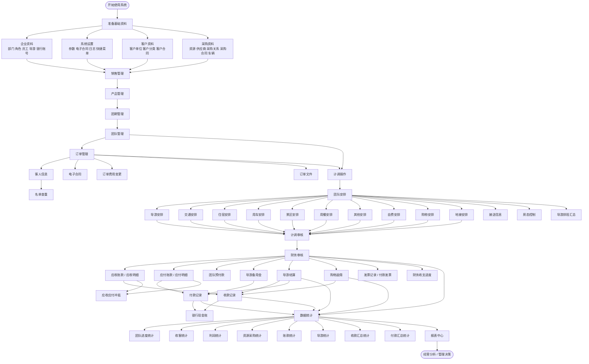
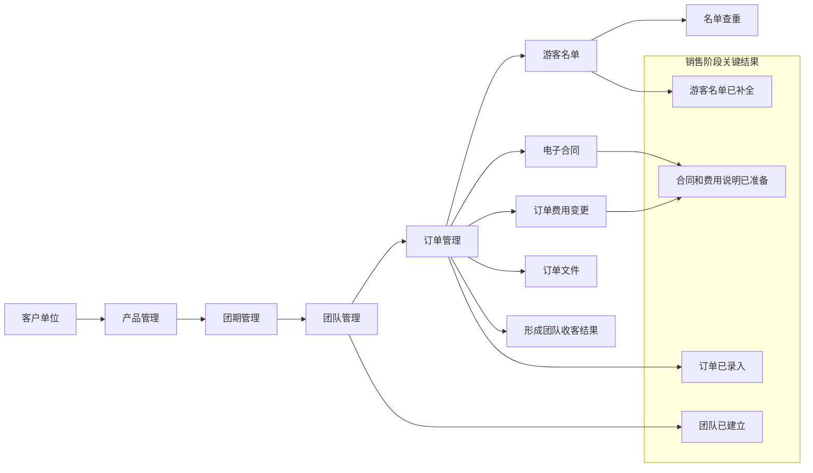
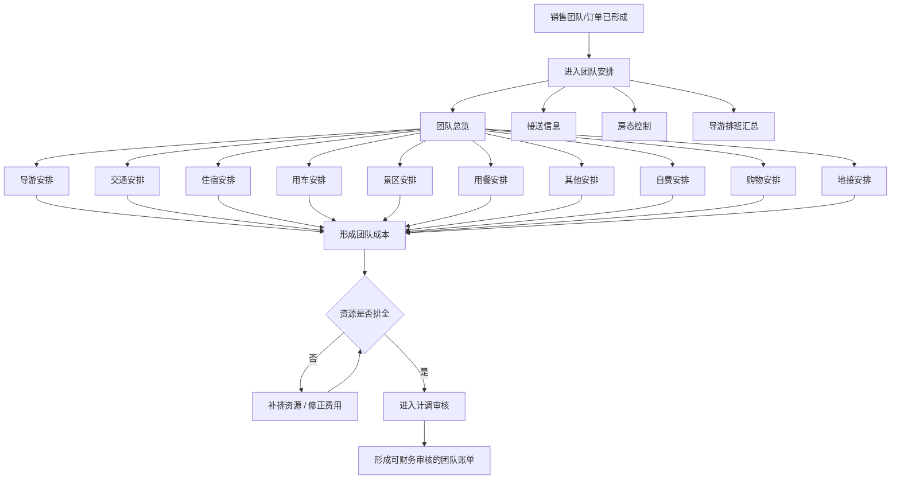
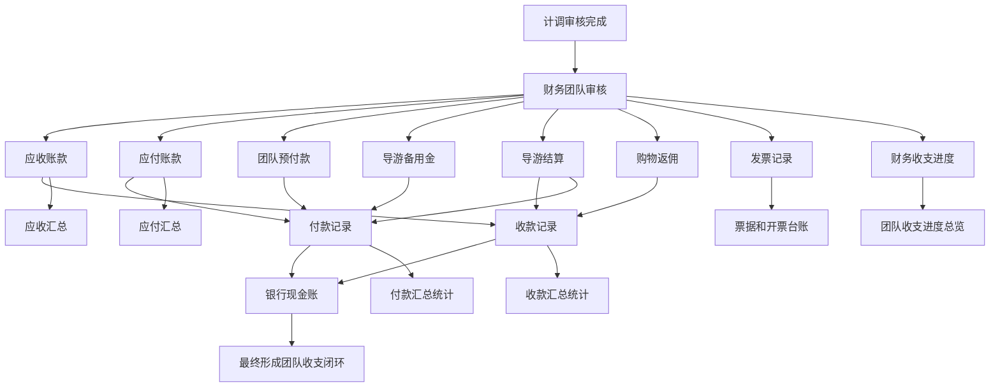
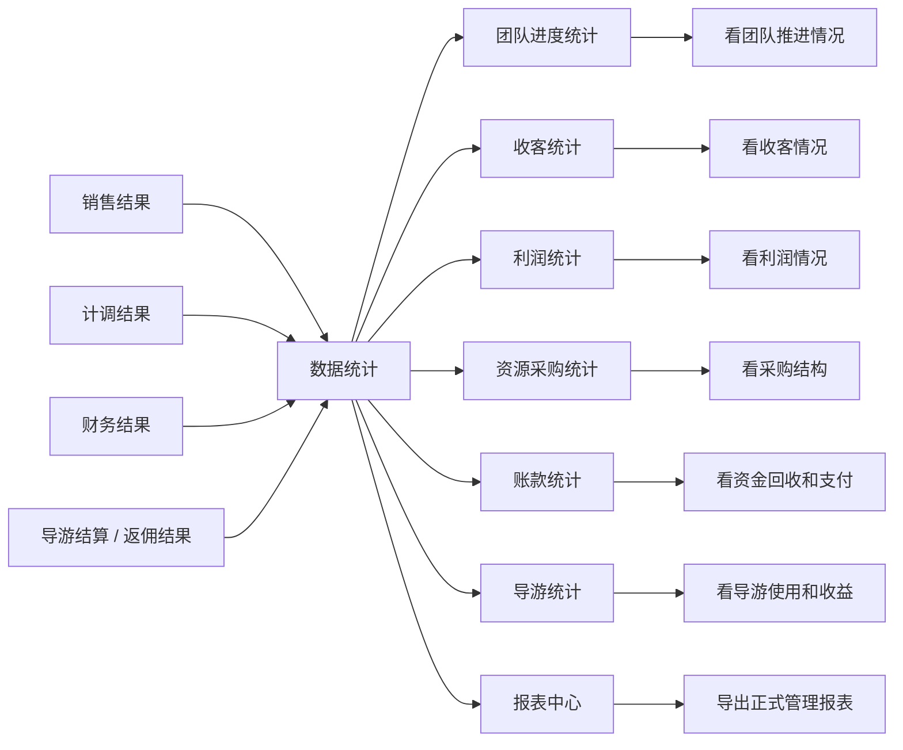
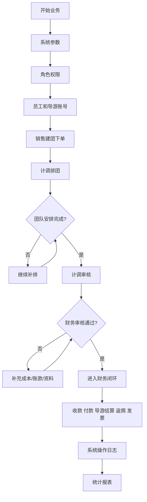
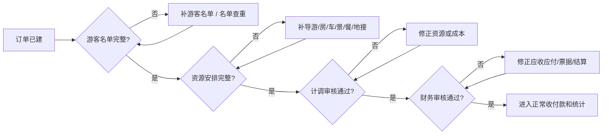

# MTravel 详细业务流程图

> 说明：本流程图基于 2026-05-09 对 `http://www.mtravel.cn` 的只读调研整理，重点描述系统中销售、计调、财务、统计之间的标准业务链。

## 一、系统全流程图

## 二、销售业务流程图

### 销售阶段说明

- `产品`解决卖什么
- `团期`解决什么时候发
- `团队`解决这批业务归到哪个团
- `订单`解决客户实际报名和应收金额
- `游客名单/电子合同`解决出团资料和合规留痕

## 三、计调履约流程图

### 计调阶段说明

- 计调的核心不是只安排导游，而是把整个团队的资源和成本排完整。
- 资源页是分开的，但最终都汇总到同一个团队账单。
- 计调审核完成，说明履约信息和主要成本已经成型。

## 四、财务结算流程图

### 财务阶段说明

- 财务不是从零记账，而是对团队已有业务单据做确认和结算。
- `应收`对应客户，`应付`对应供应商。
- `收款记录`、`付款记录`、`银行现金账`必须保持一致。
- `导游结算`和`购物返佣`是财务链里单独的重要环节。

## 五、老板看数流程图

### 管理层使用说明

老板通常不需要深入所有录入页，重点看：

- 团队进度是否卡住
- 哪些团利润异常
- 哪些客户没回款
- 哪些供应商待付款
- 哪些导游和购物返佣影响利润

## 六、系统控制点流程图

### 控制点说明

系统最关键的控制点有四个：

1. `系统参数`
   决定流程规则和统计口径。

2. `团队安排完成`
   决定能否顺利进入审核。

3. `财务审核通过`
   决定能否进入稳定结算状态。

4. `系统操作日志`
   决定关键操作是否可追溯。

## 七、异常处理路径图

### 异常处理说明

系统的标准修正路径是：

- 名单不全，回到游客名单
- 排团不全，回到团队安排
- 计调审核不过，回到资源和成本
- 财务审核不过，回到账款和票据

## 八、业务流程结论

这套系统的业务流程可以压缩成一句话：

`先建基础资料，再建产品和团队，再挂订单和游客，再做计调履约，再做财务审核和结算，最后做统计和管理分析。`

如果只抓最核心的主线，就是：

`产品 -> 团期 -> 团队 -> 订单 -> 团队安排 -> 计调审核 -> 财务审核 -> 收付款 -> 利润统计`
